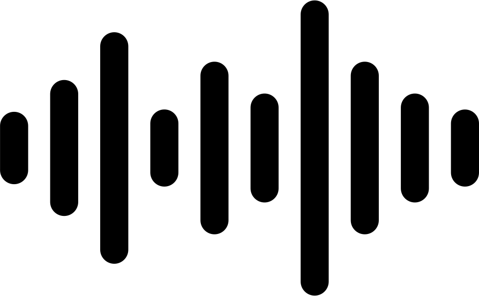

    

<h2 align="center"> Music Player</h2>

[![Discord][discord-shield]][discord-url]
[![Language][language-shield]][language-url]
[![License][license-shield]][license-url]

<ol>
    <li><a href="#about-the-project">About The Project</a></li>
    <li><a href="#future-goals">Future Goals</a></li>
    <li><a href="#installation">Installation</a></li>
</ol>

<!-- [![Downloads][downloads-shield]][downloads-url] --> 
<!-- Uncomment when a release is made -->

## About the project
This is a Python GUI music player (not feature-complete)

## Future Goals

|Volume|Music|
|:---:|:---:|
|☑ Sliding volume control|Download music with yt-dlp|

|PEP8|GUI|
|:---:|:---:|
|Code fully PEP8 compliant|Make a decent GUI, just so it looks good|

|Playback|
|:---:|
|Play audio from video file, and larget format compatibility like .wav or .webm|

## Installation

#### If you have [Chocolatey](https://chocolatey.org/) installed, run `choco install python` and skip steps 1.

1) Download the latest version of [Python](https://www.python.org/downloads/), make sure it is added to the PATH. (This is an option on installation.)

2) Download the [source code](https://github.com/Bobertkiller/Music-Player/archive/refs/heads/main.zip).

3) Extract **all** files to an empty folder.

4) Open a terminal within the folder.

5) `pip install -r requirements.txt`

6) `main.py`

<!-- [downloads-shield]: https://img.shields.io/github/downloads/Bobertkiller/Music-Player/total?style=for-the-badge&logo=github
[downloads-url]: https://github.com/Bobertkiller/Music-Player/releases/latest -->
<!-- Uncomment when a release is made -->

[language-shield]: https://img.shields.io/github/languages/top/Bobertkiller/Music-Player?logo=python&logoColor=yellow&style=for-the-badge
[language-url]: https://www.python.org/

[license-shield]: https://img.shields.io/github/license/Bobertkiller/Music-Player?style=for-the-badge
[license-url]: https://github.com/Bobertkiller/Music-Player/blob/main/LICENSE

[discord-shield]: https://img.shields.io/discord/1068543728274382868?color=7289da&label=Support&logo=discord&logoColor=7289da&style=for-the-badge
[discord-url]: https://discord.gg/7qK8sfEq2q
[discord-banner]: https://discordapp.com/api/guilds/1068543728274382868/widget.png?style=banner2